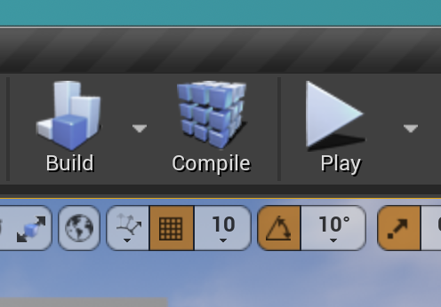
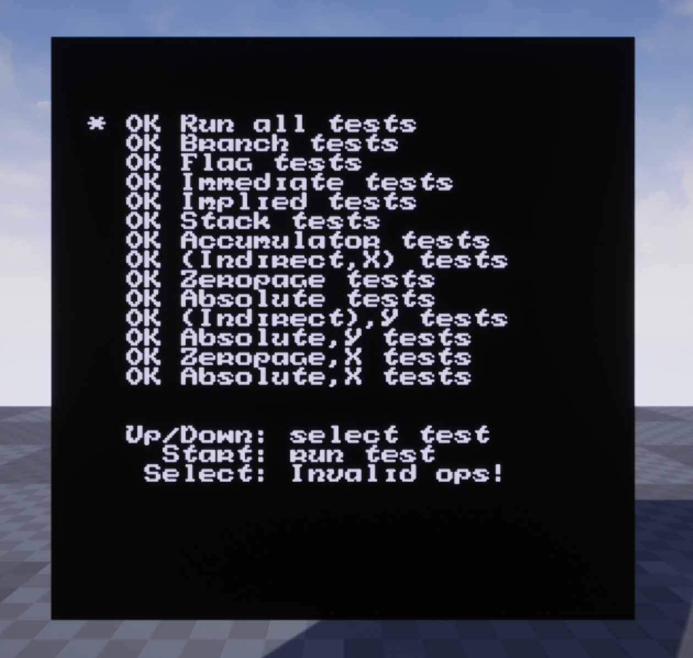
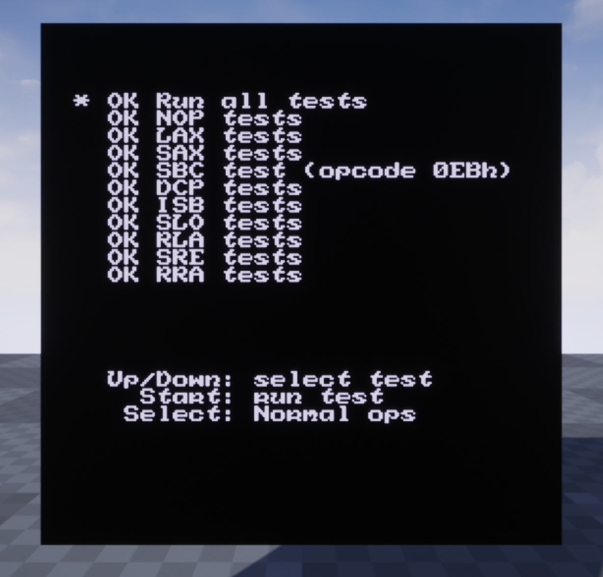

# NESUNREAL

A Nes emulator written using C++/Unreal game engine.

# How to build

Must be built using Unreal. The Unreal editor provides buttons to build, compile, and run the emulator in the editor.

# IDE

The code was written using VSCode. However, to avoid painful code writting, I suggest using Unreal Rider as the IDE. 

# Screenshots of the emulator running

